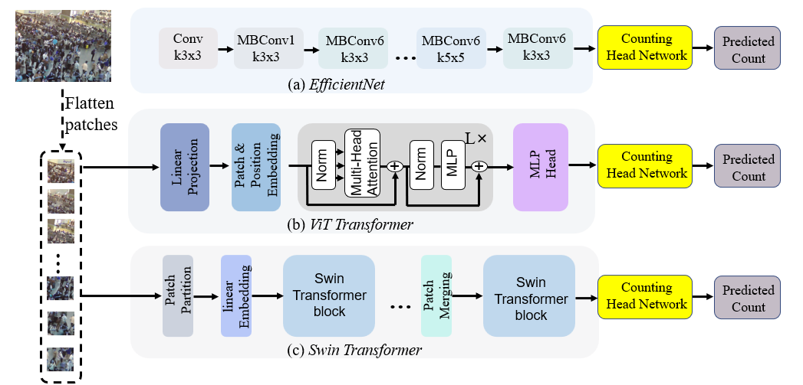

# A Simple and Effective Baseline
* An officical implementation of weakly-supervised crowd counting with token attention and fusion. Our work presents a simple and effective crowd counting method with only image-level count annotations,
i.e., the number of people in an image (weak supervision).We investigate three backbone networks regarding transfer learning capacity in the weakly supervised crowd counting problem. Then, we propose an effective network composed of a Transformer backbone and token channel attention module (T-CAM) in the counting head, where the attention in channels of tokens can compensate for the self-attention between tokens of the Transformer. Finally, a simple token fusion is proposed to obtain
global information.
# Weakly-supervised crowd counting with token attention and fusion: A Simple and Effective Baseline (ICASSP 2024)
* An officical implementation of WSCC_TAF: weakly-supervised crowd counting with token attention and fusion. Our work presents a simple and effective crowd counting method with only image-level count annotations, i.e., the number of people in an image (weak supervision).We investigate three backbone networks regarding transfer learning capacity in the weakly supervised crowd counting problem. Then, we propose an effective network composed of a Transformer backbone and token channel attention module (T-CAM) in the counting head, where the attention in channels of tokens can compensate for the self-attention between tokens of the Transformer. Finally, a simple token fusion is proposed to obtain global information.

* Paper [Link](https://ieeexplore.ieee.org/document/10446636)
## Overview


# Comparison between four backbone networks on Part_A of the ShanghaiTech dataset
| Backbone | MAE | MSE | 
|:---------:| :----------:|:-------:| 
EfficientNet-B7 |76.4 | 115.0 
ViT-B-384 | 72.6 | 123.4 
Swin_B-384 | 67.0 | 108.5 
Mamba | 71.7 | 122.8 

# Backbone of mamba
- Code refers to [here](https://github.com/hustvl/Vim)

# Environment

	python >=3.6 
	pytorch >=1.5
	opencv-python >=4.0
	scipy >=1.4.0
	h5py >=2.10
	pillow >=7.0.0
	imageio >=1.18
	timm==0.1.30

# Datasets

- Download ShanghaiTech dataset from [Baidu-Disk](https://pan.baidu.com/s/15WJ-Mm_B_2lY90uBZbsLwA), passward:cjnx; or [Google-Drive](https://drive.google.com/file/d/1CkYppr_IqR1s6wi53l2gKoGqm7LkJ-Lc/view?usp=sharing)
- Download UCF-QNRF dataset from [here](https://www.crcv.ucf.edu/data/ucf-qnrf/)
- Download JHU-CROWD ++ dataset from [here](http://www.crowd-counting.com/)
- Download NWPU-CROWD dataset from [Baidu-Disk](https://pan.baidu.com/s/1VhFlS5row-ATReskMn5xTw), passward:3awa; or [Google-Drive](https://drive.google.com/file/d/1drjYZW7hp6bQI39u7ffPYwt4Kno9cLu8/view?usp=sharing)


# Prepare data

```
cd data
run  python predataset_xx.py
```
“xx” means the dataset name, including sh, jhu, qnrf, and nwpu. You should change the dataset path.

Generate image file list: 
```
run python make_npydata.py
```

# Training

**Training example:**

```
python train.py --dataset ShanghaiA  --save_path ./save_file/ShanghaiA --batch_size 24 --model_type 'token' 
python train.py --dataset ShanghaiA  --save_path ./save_file/ShanghaiA batch_size 24 --model_type 'gap'
python train.py --dataset ShanghaiA  --save_path ./save_file/ShanghaiA batch_size 24 --model_type 'swin'
python train.py --dataset ShanghaiA  --save_path ./save_file/ShanghaiA batch_size 24 --model_type 'mamba'
```
Please utilize a single GPU with 24G memory or multiple GPU for training. On the other hand, you also can change the batch size.

# Testing
**Test example:**

Download the pretrained model from [Baidu-Disk](https://pan.baidu.com/s/1OJZmZfDGOuHCVMtJwrPHUw), passward:8a8n

```
python test.py --dataset ShanghaiA  --pre model_best.pth --model_type 'gap'
...
```

# Reference
If you find this project is useful for your research, please cite:
```
@inproceedings{wang2024weakly,
  title={Weakly-Supervised Crowd Counting with Token Attention and Fusion: A Simple and Effective Baseline},
  author={Wang, Yi and Hu, Qiongyang and Chau, Lap-Pui},
  booktitle={ICASSP 2024-2024 IEEE International Conference on Acoustics, Speech and Signal Processing (ICASSP)},
  pages={13456--13460},
  year={2024},
  organization={IEEE}
}
```
